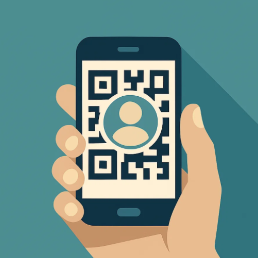
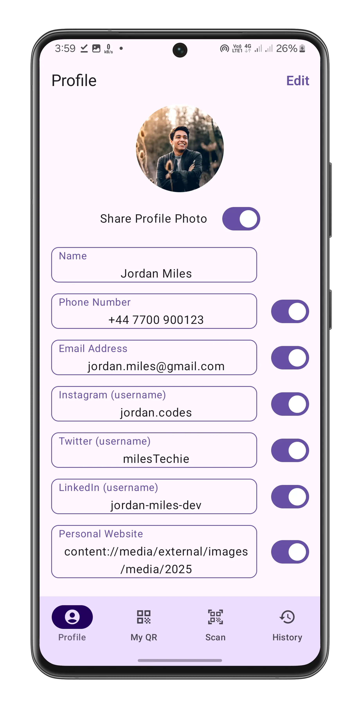
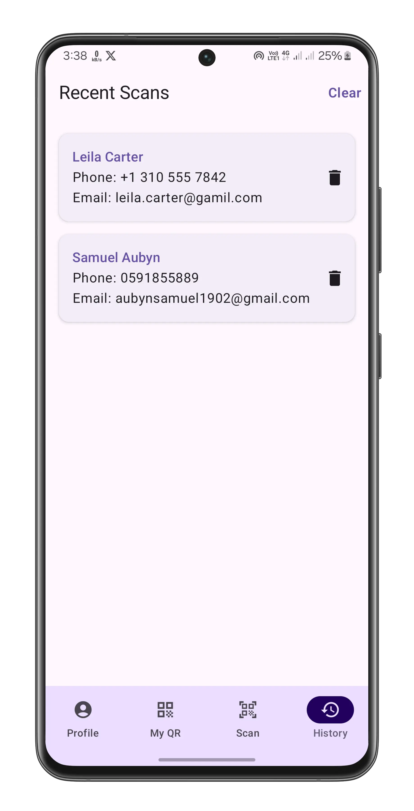
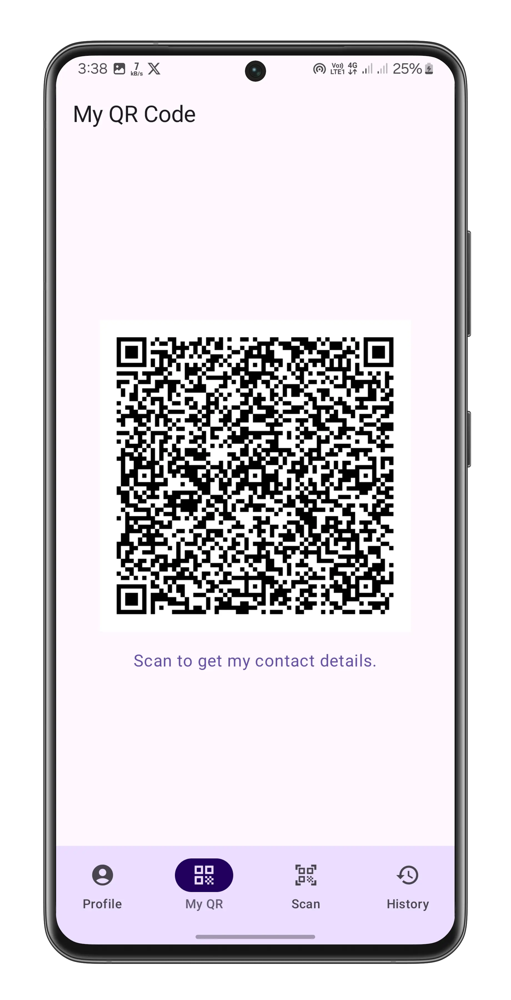
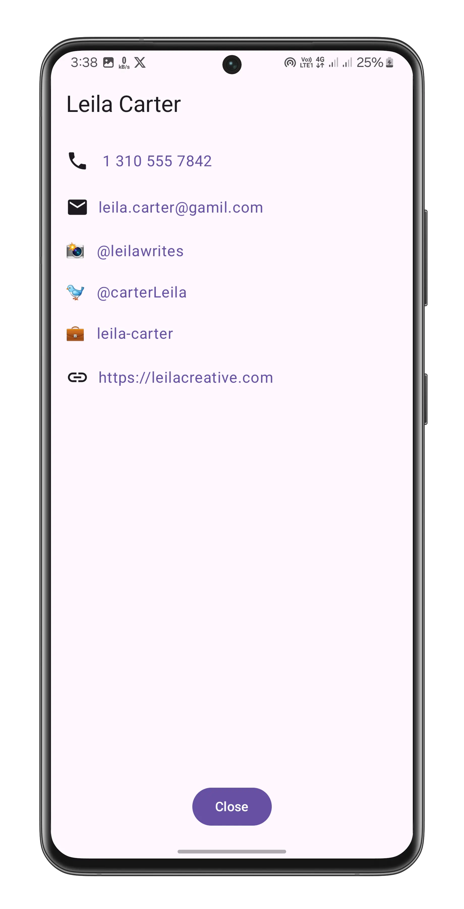

    

# CardIt

A modern Android app that transforms your smartphone into a digital business card. Share your contact information instantly through QR codes - no more fumbling with paper cards or typing contact details manually.

## Screenshots

    
    
    
    

## ✨ Features

### 📋 Profile Management

- **Comprehensive Profile Creation**: Add your name, phone number, email, website and social media handles
- **Selective Sharing**: Choose which details to share with a simple toggle switch

### 🔗 QR Code Generation

- **Instant QR Creation**: Automatically generates QR codes from your profile information
- **Real-time Updates**: QR code updates automatically when you modify your profile
- **High-Quality Output**: Clean, scannable QR codes optimized for mobile displays

### 📷 QR Code Scanning

- **Camera Integration**: Built-in QR code scanner
- **Fast Recognition**: Powered by Google ML Kit for accurate and quick scanning
- **Auto-Save**: Scanned contacts are automatically saved to your recent scans

### 📚 Contact Management

- **Recent Scans History**: View all previously scanned contact information
- **Contact Details Display**: Beautiful, organized presentation of contact information
- **Quick Actions**: Tap to call, email, or visit social media profiles directly

## 🚀 How It Works

1. **Set Up Your Profile**: Enter your contact details and choose what information to share
2. **Generate Your QR Code**: Your personalized QR code is created automatically
3. **Share Instantly**: Show your QR code to others for immediate contact sharing
4. **Scan Others**: Use the built-in scanner to get contacts from others
5. **Manage Contacts**: Access your recent scans and contact information anytime

## 🔒 Privacy & Security

- **Local Storage**: All your data stays on your device - no cloud storage required
- **Selective Sharing**: Control exactly which information appears in your QR code
- **No Account Required**: Use the app without creating accounts or providing personal information

## 🎯 Perfect For

- **Business Professionals**: Networking events, conferences, and client meetings
- **Students**: University events, job fairs, and academic networking
- **Entrepreneurs**: Startup events, pitch sessions, and investor meetings
- **Anyone**: Social gatherings, parties, and making new connections

## 💡 Benefits

- **Eco-Friendly**: Eliminate paper business cards and reduce waste
- **Always Updated**: Your shared information is always current
- **Error-Free**: No more typos when manually entering contact information
- **Professional**: Modern approach to networking that impresses contacts
- **Convenient**: No need to carry physical cards or worry about running out

---

**Ready to go digital?** Download CardIt and revolutionize the way you share contact information!
